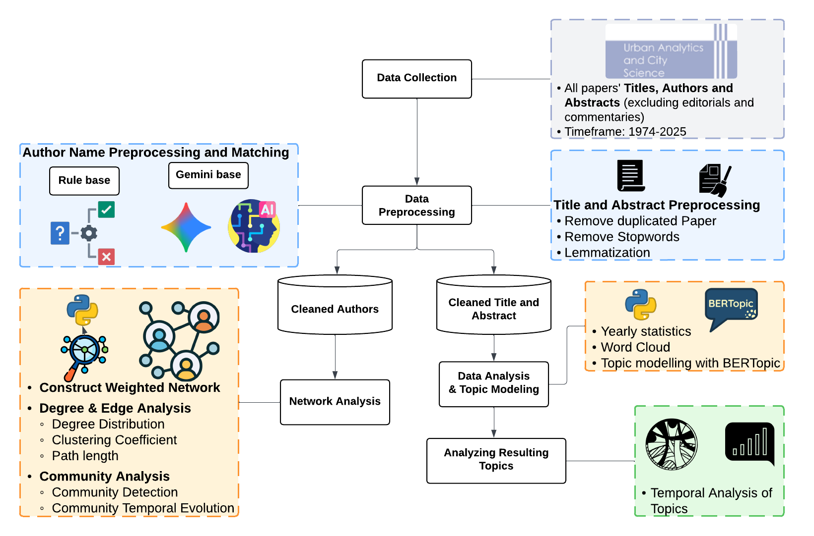

# Evolution of Environment and Planning B Authors and Topics from 1974 to March 2026

---

## 1 Method

### 1.1 Overview

This section demonstrates the overall workflow of this work while the high level overview is shown in Figure 1. Specifically, we first collected the titles and abstracts of all papers (excluding editorials and commentaries) along with the author names that have been published in Environment and Planning B (EPB). At the preprocessing stage, the data is divided into two: one is the author names dataset for network analysis and the other one is a single data corpus comprising the paper titles and abstract for text analysis. The whole workflow (e.g., network analyses and topic modeling) is implemented using NetworkX and BERTopic in Python. In addition, resulting visualizations are created using both static matplotlib plots and interactive Cosmograph displays for comprehensive exploration of network and topic structures.

Figure 1: Workflow
---

### Step 1: Preprocessing

In total, 2831 papers were published between 1974 and March 2026 on EPB. After the collection of the article information, the preprocessing is conducted based on two criteria: 1) the author for network analysis, and 2) the corpus of titles and abstracts for text analysis. With respect to the author names, we preprocess them using rule-based and AI-assisted approaches to ensure consistency throughout the analysis. For example, before the 1990s, Michael Batty was recorded as ``M. Batty'' and later as ``Batty, Michael''. Similarly, Paul Longley appeared as ``Longley, P'' (1987-1999) and ``Longley, Paul'' (2017-2024), while Anthony Gar-On Yeh shifted from ``Yeh, A G O'' (1988-1999) to ``Yeh, Anthony Gar-On'' (2002-2023). These variations are standardized to ensure accurate collaboration network construction.

As for the corpus of titles and abstracts, we removed the regular stop words (e.g., the, a, and an) along with words that appeared more than 1000 times in all titles and abstracts. In addition, any words that were too generic or less indicative of a topic (e.g., technique, important, existing, and way) were removed. 

---

### Step 2.1: Network Analysis

We constructed and analyzed the EPB collaboration network using a multi-step approach designed to
capture both the structure and evolution of academic partnerships

#### 2.1.1: Network Construction

The collaboration network was built from the standardized author data, where nodes represent individual authors and edges represent collaborative relationships. We employed a weighted network approach where each collaboration receives a weight inversely proportional to the number of co-authors on a paper.

**Weight Calculation Method**

For a paper *p* with *n* authors, each pairwise collaboration receives a weight of *w = 1/n*. This fractional weighting scheme ensures that each paper contributes a total weight of 1 to the network, distributed equally among all possible author pairs. Formally, for authors *i* and *j* collaborating on paper *p*, the contribution to their edge weight is:

where *np* is the number of authors on paper *p*. The total weight of edge *(i,j)* across all their collaborations is:

where *P{ij}* represents the set of papers on which authors *i* and *j* have collaborated.

This weighting design serves two critical purposes: (1) it prevents highly collaborative papers from
dominating the network structure, ensuring that a single paper with many authors does not overshadow
multiple smaller collaborations, and (2) it maintains proportional representation where each paper’s
total contribution remains constant regardless of author count.

**Weighted Degree Calculation**

An author's weighted degree represents their total collaborative intensity, computed as:

where *N(i)* is the set of all collaborators of author *i*. This measure captures both the breadth
(number of different collaborators) and intensity (cumulative collaboration strength) of an author’s
partnerships.

The network construction process involved three key steps: (1) parsing author strings using established
delimiters (semicolons, pipes, “and” conjunctions), (2) applying the standardized author
mapping to resolve name variants, and (3) creating weighted edges between all author pairs within each paper using the fractional weighting scheme described above. This approach resulted in a comprehensive
network capturing the full spectrum of EPB collaborations from the 1970s to the 2020s.

#### 2.1.2. Network Filtering and Core Structure Identification

To focus on the most significant collaborative patterns, we applied a degree-based filtering strategy.
Authors with fewer than a minimum threshold of collaborations were excluded to concentrate on the
core research community. The filtering process balanced network comprehensiveness with analytical
tractability, typically retaining networks of 500-4000 nodes depending on the analysis requirements.
We analyzed both weighted and unweighted network properties to understand different aspects
of collaboration. Weighted measures emphasize the intensity of collaborative relationships, while
unweighted measures focus on the breadth of partnerships.

#### 2.1.3: Structural Analysis

Our structural analysis examined four key network properties:

***Degree Distribution Analysis***: We calculated both weighted and unweighted degree distributions to
identify hub authors and understand the concentration of collaborative activity. The analysis included
power-law fitting to assess whether the network exhibits scale-free properties common in academic
collaboration networks.

***Clustering Coefficient***: Local clustering coefficients were computed to measure the tendency of authors’
collaborators to also collaborate with each other, indicating the formation of tight-knit research
groups.

***Small-World Properties***: We examined path length distributions and network diameter to assess the
“small-world” phenomenon, where authors can reach each other through short chains of collaborators
despite the network’s large size.

***Degree-Degree Correlation***: We analyzed the correlation between node degrees to determine whether
the network is assortative (high-degree nodes connect to other high-degree nodes) or disassortative.

#### 2.1.4: Community Detection

We employed the Louvain algorithm for community detection, which optimizes network modularity to
identify densely connected groups of authors. To ensure reproducibility, we used fixed random seeds
and standardized community identifiers based on community size and key members. The algorithm
iteratively moves nodes between communities to maximize modularity, defined as:

where *Aij* is the adjacency matrix, *ki * is the degree of node *i*, *m* is the total number of edges, and
*δ(ci, cj)* equals 1 if nodes *i* and *j* belong to the same community.

#### 2.1.5: Temporal Evolution Analysis

To understand how collaborative patterns evolved over time, we conducted decade-based temporal
analysis (1970s, 1980s, 1990s, 2000s, 2010s, 2020s). For each decade, we identified active authors and
analyzed community structure changes, including:
- Community membership stability and migration patterns;
- Evolution of leadership within communities;
- Changes in Collaboration Intensity and Network Density;
- Emergence and dissolution of research groups;

This temporal approach allowed us to track the EPB research community’s development and identify
key transition periods in the journal’s collaborative landscape.

### Step 2.2: Text Analysis

#### Step 2.2.1: Basic Analysis

We then processed the data corpus of titles and abstracts by removing regular stop words (e.g. the,
a, and an) along with words that appeared more than 1000 times in all abstracts from 1974 to 2024
as well as any words that were too generic or less indicative of a topic (e.g. technique, important,
existing, and way). From the processed data corpus of titles.

#### Step 2.2.1: Topic Modeling

With respect to the corpus of the abstracts, we removed regular stop words (e.g. a, an, and the) before
providing it to a pre-trained language model built upon the Bidirectional Encoder Representations from
Transformers (BERT) framework [Devlin et al., 2019], which looks for relationships between words
among different abstracts through embedding approaches (see Crooks et al. (2024) for
more details). In order to explore the topics over time we applied a Python package called BERTopic
(Koroteev, 2021) to classify each abstract into a topic and to then determine the representative words
for each topic. BERTopic classified all abstracts into 40 topics including one irrelevant or outlier topic
(see Grootendorst (2022) for more details).

## References

- **Crooks, A., Jiang, N., See, L., Alvanides, S., Arribas-Bel, D., Wolf, L., and Batty,
M. (2024)**. Epb turns 50 years old: An analytical tour of the last five decades. Environment and
Planning B: Urban Analytics and City Science, 51(5):1028–1037.
-  **Devlin, J., Chang, M.-W., Lee, K., and Toutanova, K. (2019)**. BERT: Pre-training
of deep bidirectional transformers for language understanding. arXiv.
-  **Grootendorst, M. (2022)**. Bertopic: Neural topic modeling with a class-based
TF-IDF procedure. arXiv.
- **Koroteev, M. V. (2021)**. BERT: A review of applications in natural language processing
and understanding. arXiv.
